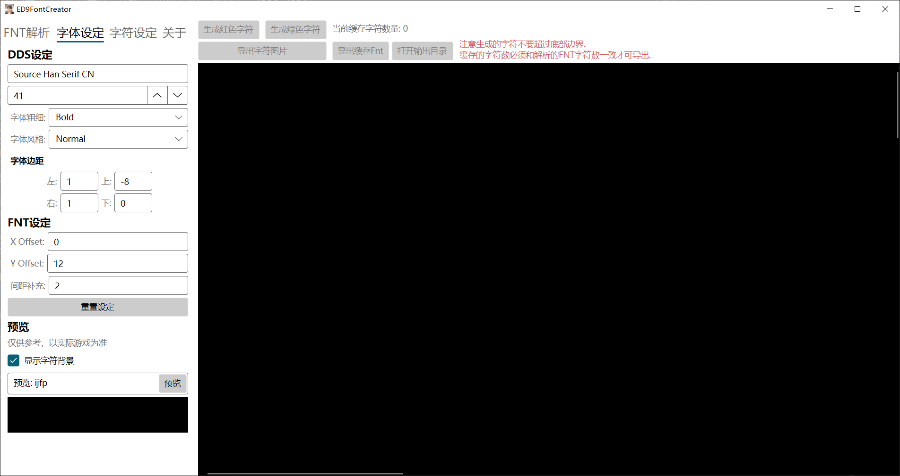
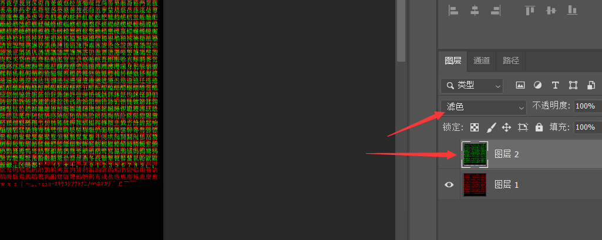
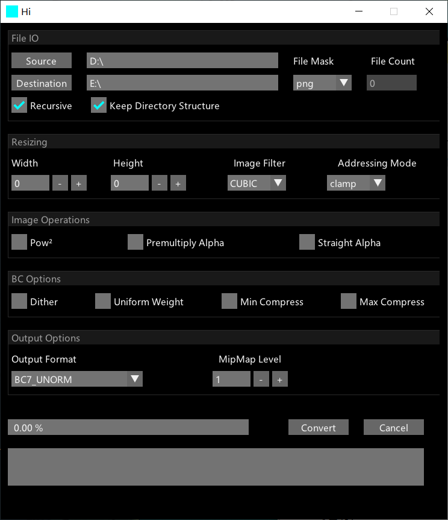

# 介绍
自定义黎之轨迹的字体文件(纹理和fnt文件), 提供字符替换和简繁转换功能,  
不过不能直接使用纹理文件, 需要PS和dds转换后才能使用.  
云豹版Nisa版测试可用, 副作用不详. 纹理尺寸用的是Nisa版尺寸: 4096*4096  
  
 
### 已知问题
一些字体的文字显示效果不在意料之中, 如常见字体下的j和f, 它们显示在获取的宽高以外, 这导致游戏中这个字符与这个字符周围的纹理裁剪错误, 显示杂点.  
目前解决办法是扩大字体边界或更换字体, 当然你也可以修改代码来特殊处理, 效果会更好.  

# 前置
 .net8、PS和[TexconvGui](https://github.com/bj-rn/texconvgui)
# 使用
### FNT解析
以黎之轨迹Nisa版为例, 打开**ED9FontCreator**后拖动**game\asset\common\font\font_\*.fnt**到Fnt文件路径文本框中, 之后点击解析, 成功则会显示总字符数和数据长度.
### 字体设定
根据自己的需求设定字体, 推荐使用字符齐全的字体, 比如思源系列的字体.  
默认设置是我个人使用的思源宋体.  
如果字体空白过大, 可以使用字体边距调整.  
Fnt设定的XY offset是游戏使用的字体显示偏移, 推荐默认.  
间距补充是战斗信息框中两个字符之间的间隔, 推荐2.  
调整设置后可先预览查看是否是自己需要的效果. 注意: 预览会沿用字符设定.  
### 字符设定
简繁转换和特定字符的替换.
### 生成
以上设定完成后再进行下方操作:  
1. 生成红色字符, 等黑色页面出现红色字符后, 等待其调整完成(一秒)之后查看是否超过底部的边界, 如果超过了就需要调整字体大小或边距.   
2. 生成绿色字符, 与上方同样的操作.  
3. 此时缓存的字符数量应该和Fnt解析出来的总字符数一致, 点击导出缓存Fnt.  
4. 打开输出目录, 应该有3个文件在里面, **font_\*.fnt、g.png和r.png**,
打开**PS**, 把两张相同像素大小的png图片重叠在一起, 左上角对齐, 把叠在上方的图层混合模式设置为滤色.
导出png到新建文件夹中.
 
5. 打开**TexconvGui**, Source选择刚才PS导出的新建文件夹, Destination选择导出目录, Output Format选择**BC7_UNORM**, 点击Convert, 等待其转换结束.  
 
6. 注意备份!! 此时我们把**ED9FontCreator**输出目录中的**font_\*.fnt**覆盖到**game\\asset\common\font**目录,  
把**TexconvGui**转换好的**font_\*.dds**文件覆盖到**ame\asset\dx11\image**目录, 启动游戏查看是否成功.
# 游戏效果(思源黑体)
 
 
# 参考
[黎之轨迹工具包（更新中：2022/8/24）](https://bbs.3dmgame.com/forum.php?mod=viewthread&tid=6321673&page=1&extra=#pid301960392)
[ED9FontConverter](https://github.com/TwnKey/ED9FontConverter)
