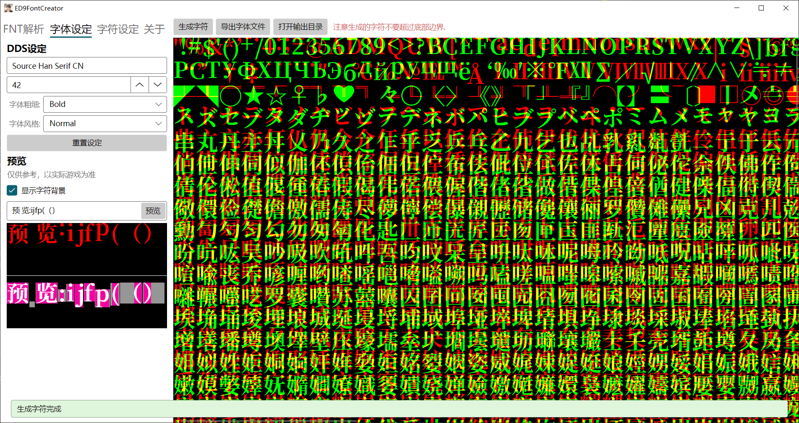

# 介绍
自定义黎之轨迹的字体文件(纹理和fnt文件), 提供字符替换和简繁转换功能, 转换完成后替换游戏文件即可.  
云豹版Nisa版测试可用, 副作用不详. 纹理尺寸用的是Nisa版尺寸: 4096*4096  
  
 

# 前置
 .net8
# 使用
### FNT解析
以黎之轨迹Nisa版为例, 打开**ED9FontCreator**后拖动**game\asset\common\font\font_\*.fnt**到Fnt文件路径文本框中, 之后点击解析, 成功则会显示总字符数和数据长度.
### 字体设定
根据自己的需求设定字体, 推荐使用字符齐全的字体, 比如思源系列的字体.  
默认设置是我个人使用的思源宋体.  
Fnt设定的XY offset是游戏使用的字体显示偏移(X偏移游戏似乎不起作用), 推荐默认.  
调整设置后可先预览. 注: 预览会沿用字符设定.  
### 字符设定
简繁转换和特定字符的替换.
### 生成
以上设定完成后再进行下方操作:  
1. 生成字符图片.  
2. 导出字体文件. 
3. 打开输出目录, 应该有2个文件在里面, **font_\*.fnt和font_\*.dds**.  
4. 注意备份!! 此时我们把**font_\*.fnt**覆盖到**game\\asset\common\font**目录,  
把**font_\*.dds**文件覆盖到**ame\asset\dx11\image**目录, 启动游戏查看是否成功.
# 游戏效果(思源宋体Bold)
 
 
# 参考
[黎之轨迹工具包（更新中：2022/8/24）](https://bbs.3dmgame.com/forum.php?mod=viewthread&tid=6321673&page=1&extra=#pid301960392)
[ED9FontConverter](https://github.com/TwnKey/ED9FontConverter)
